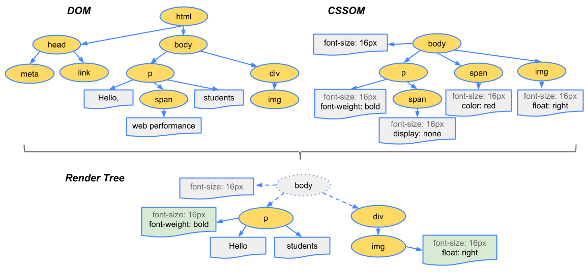

# 浏览器加载及渲染机制

 <p class="article-desc">日期:2019.4.7</p>

 ---

最近看了一篇文章[《JS一定要放在Body的最底部么？聊聊浏览器的渲染机制》](./http://delai.me/code/js-and-performance/).从一道面试题说起,然后剖析了浏览器的加载和渲染机制.

> 为什么大家普遍把<script src=""></script>这样的代码放在body最底部？（为了沟通效率，我会提前和对方约定所有的讨论都以chrome为例）

在没有看过文章之前,估计我会回答为了是加快浏览器对页面的渲染.但是是哪个步骤,哪个时刻加速了就不得而知了.看过了这篇文章,大致了解了浏览器的加载和渲染机制.但是对于文中的有些说法百思不得其解,因此在某些问题上以实验的形式加以验证,故而对实验结果的总结对错与否估计也不能下个定论,只能权当参考.

## 浏览器的渲染机制

### 几个概念

- 1、DOM：Document Object Model，浏览器将HTML解析成树形的数据结构，简称DOM。

- 2、CSSOM：CSS Object Model，浏览器将CSS代码解析成树形的数据结构。

- 3、DOM 和 CSSOM 都是以 Bytes → characters → tokens → nodes → object model. 这样的方式生成最终的数据。如下图所示： 


**DOM树的构建过程是一个深度遍历过程：当前节点的所有子节点都构建好后才会去构建当前节点的下一个兄弟节点。**

- 4、Render Tree：DOM 和 CSSOM 合并后生成 Render Tree，如下图： 



`Render Tree` 和`DOM`一样，以多叉树的形式保存了每个节点的`css`属性、节点本身属性、以及节点的孩子节点。

注意：`display:none` 的节点不会被加入`Render Tree`，而`visibility: hidden` 则会，所以，如果某个节点最开始是不显示的，设为`display:none`是更优的。具体可以看这里


### 浏览器的渲染过程

- 1、Create/Update DOM And request css/image/js：

浏览器请求到`HTML`代码后，在生成`DOM`的最开始阶段（应该是 `Bytes` → `characters` 后），并行发起`css`、图片、`js`的请求，无论他们是否在`HEAD`里。

注意：发起`js`文件的下载`request`并不需要`DOM`处理到那个`script`节点，比如：简单的正则匹配就能做到这一点，虽然实际上并不一定是通过正则。这是很多人在理解渲染机制的时候存在的误区

- 2、`Create/Update Render CSSOM`：

`CSS`文件下载完成，开始构建`CSSOM`

- 3、`Create/Update Render Tree`：

所有`CSS`文件下载完成，`CSSOM`构建结束后，和 `DOM` 一起生成 `Render Tree`。

- 4、Layout：

有了`Render Tree`，浏览器已经能知道网页中有哪些节点、各个节点的CSS定义以及他们的从属关系。下一步操作称之为`Layout`，顾名思义就是计算出每个节点在屏幕中的位置。

- 5、Painting：

`Layout`后，浏览器已经知道了哪些节点要显示（which nodes are visible）、每个节点的CSS属性是什么（their computed styles）、每个节点在屏幕中的位置是哪里（geometry）。就进入了最后一步：Painting，按照算出来的规则，通过显卡，把内容画到屏幕上。

以上五个步骤前3个步骤之所有使用 “`Create/Update`” 是因为`DOM`、`CSSOM`、`Render Tree`都可能在第一次`Painting`后又被更新多次，比如`JS`修改了`DOM`或者`CSS`属性。

`Layout` 和 `Painting` 也会被重复执行，除了`DOM`、`CSSOM`更新的原因外，图片下载完成后也需要调用`Layout` 和 `Painting`来更新网页。


以上都是《JS一定要放在Body的最底部么？聊聊浏览器的渲染机制》归纳总结出来的,并且文中一直都有提到"首屏"这个词,为了一致,本文中的"首屏"也是同一个意思,即,“没有图片的首屏”.

再来回到之前的面试问题,"script标签的位置会影响首屏时间么？"

其实通过上面的浏览器渲染过程的描述可以得知,其实`script`的位置不会影响首屏的时间,但有可能截断首屏的内容，使其只显示上面一部分。

并且《JS一定要放在Body的最底部么？聊聊浏览器的渲染机制》文中也总结了以下几点:

- 如果script标签的位置不在首屏范围内，不影响首屏时间
- 所有的script标签应该放在body底部是很有道理的
- 但从性能最优的角度考虑，即使在body底部的script标签也会拖慢首屏出来的速度，因为浏览器在最一开始就会请求它对应的js文件，而这，占用了有限的TCP链接数、带宽甚至运行它所需要的CPU。这也是为什么script标签会有async或defer属性的原因之一。

## 疑惑和注意点

对于浏览器渲染过程有一定的了解了,但是还是有些疑惑以及注意点.

### 1. 第一次渲染耗时与script位置是无关的

通过对浏览器渲染过程的了解,我们可以发现其实浏览器第一次做`Painting`,是在`Render tree`构建完成后,`layout`计算完成以后进行的.那么可以理解为,如果(我是说如果,当然估计这种情况会很少)您要加载的`js`不会去改变`dom`的结构或样式.那么其实`script`标签放在什么位置并不会影响到浏览器的渲染耗时.

我们可以看看下面的例子.我们写了一个简单的`web`服务,使用`node.js`做后台,实际上后台仅仅只是一个静态资源服务器而已.我们在这个服务上面动了一点点的手脚,即,如果是请求`bootstrap.min.js`,那么我们将等待2秒后才返回,其他资源正常返回.

> 例子工程地址:https://github.com/btshj-snail/exp-browserPainting

同时,我们建立一个简单的html界面,这个界面引入了三个css,三个js.这个界面代码如下:

```html

<!DOCTYPE html>
<html lang="en">
  <head>
    <meta charset="UTF-8" />
    <meta name="viewport" content="width=device-width, initial-scale=1.0" />
    <meta http-equiv="X-UA-Compatible" content="ie=edge" />
    <title>Document</title>
    <link rel="stylesheet" href="./style/bootstrap.min.css" />
    <link rel="stylesheet" href="./style/bootstrap-theme.min.css" />
    <link rel="stylesheet" href="./style/main.css" />
  </head>
  <body>
    <div>
      <p id="first" class="beautiful"></p>
      <p>人之初 性本善 性相近 习相远</p>
      <p>苟不教 性乃迁 教之道 贵以专</p>
      昔孟母 择邻处 子不学 断机杼<br />
      
      <p id="content"></p>
    </div>

    <script src="./js/jquery-2.1.1.min.js"></script>
    <script src="./js/bootstrap.min.js"></script>
    <script src="./js/main.js"></script>
  </body>
</html>

```
main.js文件中仅有一个简单的逻辑处理,即在id为content的元素中插入一些话而已.

```javaScript
//main.js
document.querySelector("#content").innerHTML = "请注意,请注意,重点不是美女....重点是你看到这串文字..这才是老夫的真实用意..这句话是通过js动态追加的.当你看到这句话的时候,表明这个js文件已经运行了...其实在你不知道的时候,我偷偷的将另外一个js延迟加载了..."


```

OK,一切都准备就绪了,那么我们来看看当我们延迟2秒返回`bootstrap.min.js`文件,会对`main.js`造成什么样的影响.

从`github`上`clone`下来工程,然后进入工程目录,输入命令` node ./server/app.js` ,然后使用chrome访问`http://localhost:9001/static/index.html`.我们接着使用`F12`,打开`chrome`的开发者工具,点击`performance`,我们可以轻松的获取浏览器对该界面的渲染过程.


我们可以从图中可以看出,在`93.6ms`的时候,浏览器就已经开始`paint`了.而在`2048ms`时,才接受到`bootstrap.min.js`的数据.因此**第一次渲染耗时与`script`位置是无关的**.

### 2. 浏览器是严格按照script标签的顺序来加载的吗?

其实这个答案在不了解浏览器渲染过程的情况下,也知道这是肯定的.否则无法保证代码的依赖性.在很早以前,我们开发的时候,通常会将`jquery`的文件放在第一个引用,其他依赖`jquery`库的`js`文件放在其后面,这就是为了保证后面`js`文件使用`jquery`时,`jquery`已经被加载.通过这个,我们也可以得知浏览器是严格按照`script`标签的顺序来加载`js`文件的.

OK,我们依然用上面的例子来验证.上面的列子中我们引用`main.js`文件的`script`标签是放在`bootstrap.min.js`的`script`标签之后的,并且在后台,会延迟`2s`才返回`bootstrap.min.js`,那么此时`main.js`上面时候返回,浏览器什么时候开始解析执行`main.js`?


从上图我们可以得知,其实第一次paint时,其实是没有渲染出美女图片下方的文字的.那么也就是说,其实第一次`paint`时,浏览器是没有执行`main.js`.那么有可能你会说,也许接收到`main.js`文件,实在`paint`之后呢.其实这个说法,也是完全有可能的,但是呢,结论先不说,嘿嘿..我们先来看看`chrome`的`performance`的渲染过程,用事实说话,嘿嘿.


上面按照时间顺序标了4条记录.

第一条,是浏览器接收到`main.js`数据;

第二条,是浏览器第一次开始`paint`

第三条,执行`bootstrap.min.js`文件.

第四条,执行`main.js`文件.

那么完全可以看出,下载js文件是"并发"的.而执行`js`文件,则是上一个文件执行完后,才执行下一个的.那么为了加快最终渲染效果,可以将不重要或者是第一次无需使用的`js`文件,放在所有`script`的后面加载.也可以给这些`script`标签加上`defer`或`async`

## 参考文献

1、《JS一定要放在Body的最底部么？聊聊浏览器的渲染机制》<http://delai.me/code/js-and-performance/>

2、案例工程(exp-browserPainting) <https://github.com/btshj-snail/exp-browserPainting>

---


