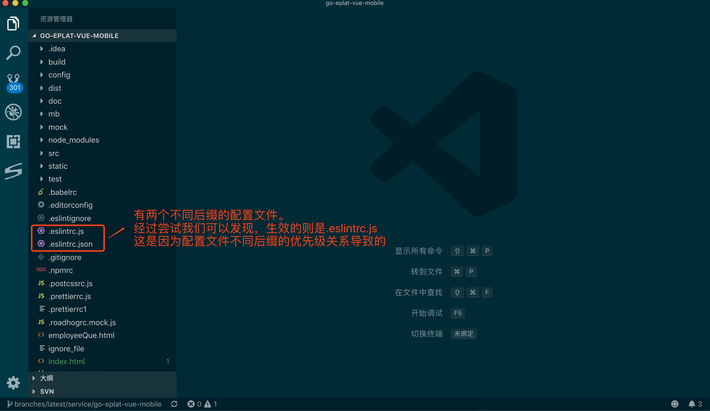
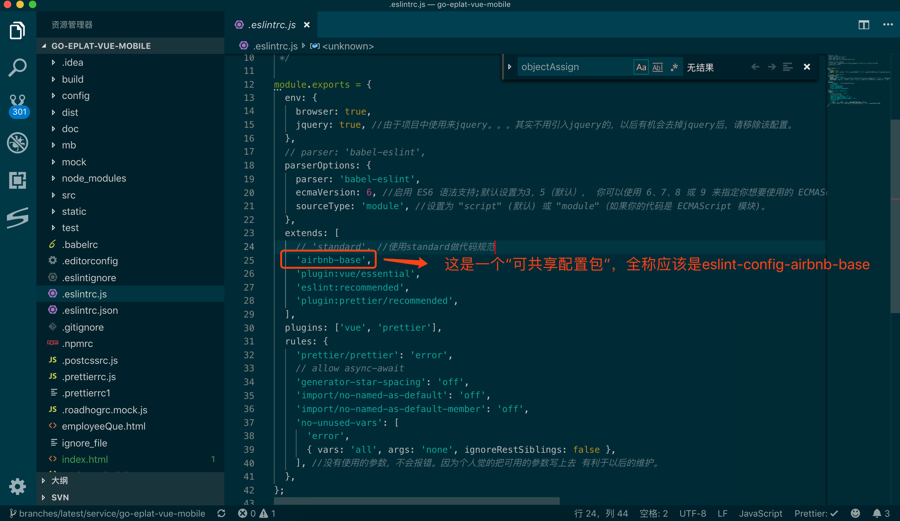
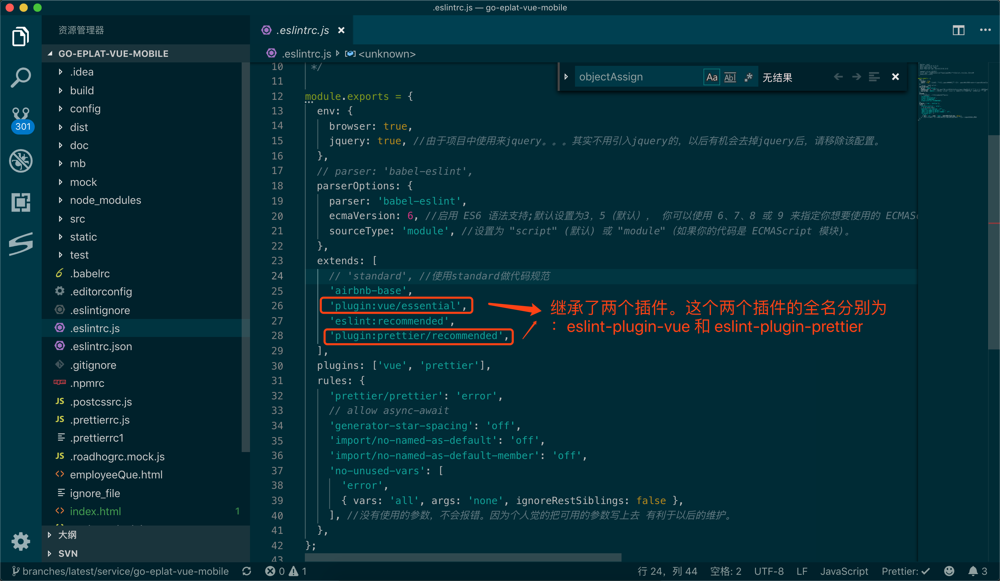
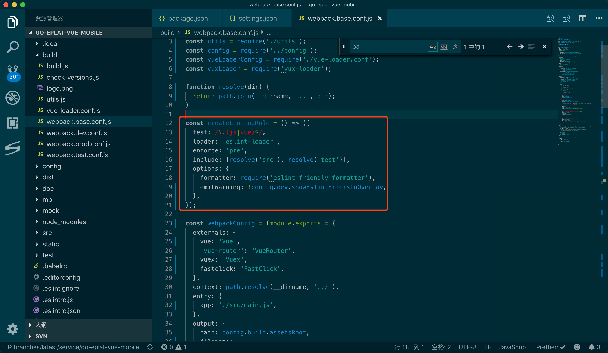

# 代码格式规范的自动化（eslint 与 prettier）

其实很早之前就想在工程中使用 `eslint` 和 `prettier` 来规范代码。可是 `eslint` 和 `prettier` 的相爱相杀，再加上框架（`vue`,`react`）的特有写法（`jsx`，`template`）等等总是让自己开发过程很痛苦，很懵逼，不知所措。所以每次都启用 `esint`，然后又禁用，又启用，又禁用，如此反复，周而复始。
前段时间看前端工程化相关的资料，发现其实工程代码格式规范是其中重要的环节之一。顾而，借着周末好好捋一捋 `eslint` 和 `prettier`，来达到开发的高效和规范。

在代码规范的道路上，我们终极目标是：

**团队中的所有开发人员用一套代码规范规则，并且无需我们花太大的精力去为了格式而格式。希望有一套自动化工具，帮我们检测代码是否规范，如果不规范，则自动能够帮我们按照既定规范格式化。**

通过对 `eslint` 和 `prettier` 的大致了解，其实可以发现，`prettier` 是用于格式化代码的。而代码规范规则的设置和代码上的 `warn`，`error` 等提醒，则是 `eslint` 来实现的。故而，我们的大目标应该是 `eslint`，然后把 `prettier` 集成进来。

## `ESLint`

> `ESLint` 是一个开源的 `JavaScript` 代码检查工具，由 Nicholas C. Zakas 于 2013 年 6 月创建。代码检查是一种静态的分析，常用于寻找有问题的模式或者代码，并且不依赖于具体的编码风格。对大多数编程语言来说都会有代码检查，一般来说编译程序会内置检查工具。

`ESLint` 的所有规则都被设计成可插入的。`ESLint` 的默认规则与其他的插件并没有什么区别，规则本身和测试可以依赖于同样的模式。
因此可配置、插件式是 `ESLint` 的最大特点，也是我们热衷使用它的原因。

### 如何配置

配置 `ESLint` 有两种方式：

- 使用 `JavaScript` 注释把配置信息直接嵌入到一个代码源文件中
- 配置文件式

这两种方式中，“配置文件”是最常见的配置方式。使用 `JavaScript`、`JSON`或者 `YAML` 文件为整个目录（处理你的主目录）和它的子目录指定配置信息。`ESLint` 会查找和自动读取它们，再者，你可以在命令行运行时指定一个任意的配置文件。

`ESLint` 支持几种格式的配置文件：

- `JavaScript` - 使用 `.eslintrc.js` 然后输出一个配置对象。
- `YAML` - 使用 `.eslintrc.yaml` 或 `.eslintrc.yml`去定义配置的结构。
- `JSON` - 使用 `.eslintrc.json` 去定义配置的结构，`ESLint` 的 `JSON` 文件允许 `JavaScript` 风格的注释。
- (弃用) - 使用 `.eslintrc`，可以使 `JSON` 也可以是 YAML。
- `package.json` - 在 `package.json` 里创建一个 `eslintConfig` 属性，在那里定义你的配置。

如果同一个目录下有多个配置文件，`ESLint` 只会使用一个。优先级顺序如下：

- `.eslintrc.js`
- `.eslintrc.yaml`
- `.eslintrc.yml`
- `.eslintrc.json`
- `.eslintrc`
- `package.json`

由于 js 里面可以很方便的书写逻辑，并且它的优先级又比较高，故而建议使用 js 文件来当作配置文件。



### 这些配置啥意思

可配置是 `ESLint` 的特点之一。也就意味着我们必须了解每个配置项什么意思，才能玩转 `ESLint`。因此接下来我们来看看常用配置项是什么意思。

#### Parser

`ESLint` 默认使用 Espree 作为其解析器，你可以在配置文件中指定一个不同的解析器.

以下解析器与 `ESLint` 兼容：

- Esprima
- Babel-ESLint - 一个对 Babel 解析器的包装，使其能够与 `ESLint` 兼容。
- typescript-eslint-parser(实验) - 一个把 TypeScript 转换为 ESTree 兼容格式的解析器，这样它就可以在 `ESLint` 中使用了。这样做的目的是通过 `ESLint` 来解析 TypeScript 文件（尽管不一定必须通过所有的 `ESLint` 规则）。
  注意，在使用自定义解析器时，为了让 `ESLint` 在处理非 `ECMAScript 5` 特性时正常工作，配置属性 `parserOptions` 仍然是必须的。解析器会被传入 `parserOptions`，但是不一定会使用它们来决定功能特性的开关。

#### parserOptions

这个属性常用于设置语法解析器的一些配置。可用的选项有：

- 1. `ecmaVersion`: 制定 `ECMAScript` 的版本。

默认设置为 3，5（默认）， 你可以使用 6、7、8 或 9 来指定你想要使用的 `ECMAScript` 版本。你也可以用使用年份命名的版本号指定为 2015（同 6），2016（同 7），或 2017（同 8）或 2018（同 9）

- 2. `sourceType`: 源码类型

设置为 "`script`" (默认) 或 "`module`"（如果你的代码是 `ECMAScript` 模块)。

- 3. `ecmaFeatures`： 这是个对象，表示你想使用的额外的语言特性:

- 3.1 `globalReturn` - 允许在全局作用域下使用 `return` 语句
- 3.2 `impliedStrict` - 启用全局 strict mode (如果 `ecmaVersion` 是 5 或更高)
- 3.3 `jsx` - 启用 `JSX`
- 3.4 `experimentalObjectRestSpread` - 启用实验性的 `object rest`/`spread properties` 支持。(重要：这是一个实验性的功能,在未来可能会有明显改变。 建议你写的规则 不要 依赖该功能，除非当它发生改变时你愿意承担维护成本。)

> 设置解析器选项能帮助 `ESLint` 确定什么是解析错误，所有语言选项默认都是 `false`

#### `Environments`

该配置属性定义来一组预定义的全局变量。可用的环境包括：

- `browser` - 浏览器环境中的全局变量。
- `node` - `Node.js` 全局变量和 `Node.js` 作用域。
- `commonjs` - `CommonJS` 全局变量和 `CommonJS` 作用域 (用于 `Browserify/WebPack` 打包的只在浏览器中运行的代码)。
- `shared-node-browser` - `Node.js` 和 `Browser` 通用全局变量。
- `es6` - 启用除了 `modules` 以外的所有 `ECMAScript 6` 特性（该选项会自动设置 `ecmaVersion` 解析器选项为 6）。
- `worker` - `Web Workers` 全局变量。
- `amd` - 将 `require()` 和 `define()` 定义为像 `amd` 一样的全局变量。
- `mocha` - 添加所有的 `Mocha` 测试全局变量。
- `jasmine` - 添加所有的 `Jasmine` 版本 1.3 和 2.0 的测试全局变量。
- `jest` - `Jest` 全局变量。
- `phantomjs` - `PhantomJS` 全局变量。
- `protractor` - `Protractor` 全局变量。
- `qunit` - `QUnit` 全局变量。
- `jquery` - `jQuery` 全局变量。
- `prototypejs` - `Prototype.js` 全局变量。
- `shelljs` - `ShellJS` 全局变量。
- `meteor` - `Meteor` 全局变量。
- `mongo` - `MongoDB` 全局变量。
- `applescript` - `AppleScript` 全局变量。
- `nashorn` - `Java 8 Nashorn` 全局变量。
- `serviceworker` - `Service Worker` 全局变量。
- `atomtest` - `Atom` 测试全局变量。
- `embertest` - `Ember` 测试全局变量。
- `webextensions` - `WebExtensions` 全局变量。
- `greasemonkey` - `GreaseMonkey` 全局变量。
  这些环境并不是互斥的，所以你可以同时定义多个。

#### `Globals`

我们使用第三方提供的全局变量的时候（例如：`jQuery`,`AMap` 等对象），`ESLint` 并不能识别他们，总是会报错。这个时候，该配置的作用就出现了。使用 `globals` 指出你要使用的全局变量。将变量设置为 `true` 将允许变量被重写，或 `false` 将不允许被重写。

#### Plugins

`ESLint` 支持使用第三方插件。在使用插件之前，你必须使用包管理工具安装它。
在配置文件里配置插件时，可以使用 `plugins` 关键字来存放插件名字的列表。插件名称可以省略 `eslint-plugin-` 前缀。

#### Rules

`ESLint` 附带有大量的规则。你可以使用注释或配置文件修改你项目中要使用的规则。要改变一个规则设置，你必须将规则 ID 设置为`off`、`warn`、`error`三者之一。

### 继承配置文件

基本要用的配置属性在上面都已经涉及到了。但是我们之前讲过 `ESLint` 不仅有可配性，还有插件的可插拔性。那么插件又是如何工作的呢？插件无外乎是增强某些功能，并且对外提供接口。在 `ESLint` 中，插件一般都是通过继承的方式，来实现对外提供特定功能。

#### `extends`

一个配置文件可以从基础配置中继承已启用的规则。

`extends` 属性值可以是：

(1)、在配置中指定的一个字符串

(2)、字符串数组：每个配置继承它前面的配置

`ESLint` 递归地进行扩展配置，所以一个基础的配置也可以有一个 `extends` 属性。

`extends` 里面可以引入 共享配置包，可以引入 插件

- 共享配置包

可共享的配置 是一个 `npm` 包，它输出一个配置对象。

`extends` 属性值可以省略包名的前缀 eslint-config-。



- 插件

插件 是一个 `npm` 包，通常输出规则。一些插件也可以输出一个或多个命名的 配置。

`plugins` 属性值 可以省略包名的前缀 `eslint-plugin-`。

`extends` 属性值可以由以下组成：

（1）、`plugin`:
（2）、包名 (省略了前缀，比如，`react`)
（3）、/
（4）、配置名称 (比如 `recommended`)



## `Prettier`

`Prettier` 是一个代码格式化工具。能够按照我们的规则，将我们的代码格式化。

为什么我们用它，而不用其他的代码格式化工具呢？Prettier 主要有以下优点：

- 可配置化
- 支持多种语言
- 集成多数的编辑器
- 简洁的配置项

## `ESLint` + `Prettier`

> 团队中的所有开发人员用一套代码规范规则，并且无需我们花太大的精力去为了格式而格式。希望有一套自动化工具，帮我们检测代码是否规范，如果不规范，则自动能够帮我们按照既定规范格式化。------我们的终极目标

通过上面的了解，要想达到我们的终极目标似乎就是将这两个一起使用即可。那么如何整合他们呢？

以`vue`工程为例：

### 第一步： 下载相关包

最基本的，我们肯定要下载`eslint`，`prettier`这两个包的。

其次，为了将其整合起来那么我们需要已写好的“共享配置包”和插件。因此我们需要下载`eslint-plugin-prettier`,`eslint-config-prettier`。

再次，我们需要站在巨人的肩膀上看世界。也就是我们需要业界一些比较成熟的规范，来规范我们的代码。因此我们可以使用大团队提供的代码规范插件。比较有名的就是`airbnb`。这里我们选用的是`airbnb-base`。故而我们需要下载`eslint-config-airbnb-base`。

最后，为了完美使用我们 ES6 的一些新特性。我们需要将“词法解析器”设置为`babel-eslint`。因此我们还需要下载`babel-eslint`.

对了，我们是`vue`工程，那么肯定要有对 vue 配置的插件，因此我们需要下载`eslint-plugin-vue`

总结可得，我们需要下载以下包

```shell

npm install esint prettier eslint-plugin-prettier eslint-config-prettier eslint-config-airbnb-base babel-eslint eslint-plugin-vue

```

### 第二步 建立配置文件

如果仔细阅读了之前`eslint`的配置项，那么这一步是比较机械化的。因此我直接将工程中的配置文件拷贝过来，加以注释吧。

在工程的根目录，创建一个`.eslintrc.js`文件，文件内容如下：

```javaScript

module.exports = {
  env: {
    browser: true,
    jquery: true, //由于项目中使用来jquery。。。其实不用引入jquery的，以后有机会去掉jquery后，请移除该配置。
  },
  parserOptions: {
    parser: 'babel-eslint', //词法解析器使用babel-eslint，以更好的适配es6的新api
    ecmaVersion: 6, //启用 ES6 语法支持;默认设置为3，5（默认）， 你可以使用 6、7、8 或 9 来指定你想要使用的 ECMAScript 版本。你也可以用使用年份命名的版本号指定为 2015（同 6），2016（同 7），或 2017（同 8）或 2018（同 9）
    sourceType: 'module', //设置为 "script" (默认) 或 "module"（如果你的代码是 ECMAScript 模块)。
  },
  extends: [
    'airbnb-base',
    'eslint:recommended',
    'plugin:vue/essential',
    'plugin:prettier/recommended',
  ],
  plugins: ['vue', 'prettier'],
  rules: {
    'prettier/prettier': 'error',
    'generator-star-spacing': 'off',
    'import/no-named-as-default': 'off',
    'import/no-named-as-default-member': 'off',
    'no-unused-vars': [
      'error',
      { vars: 'all', args: 'none', ignoreRestSiblings: false },
    ], //没有使用的参数，不会报错。因为个人觉的把可用的参数写上去 有利于以后的维护。
  },
};


```

### 开发工具

其实到上一步的话，已经将`ESlint`和`Prettier`配置完了。但是要能够自动格式化，那么我们还需要做一些集成。

实现自动格式化这一目标，可以在开发工具上做文章，也可以在`webpack`上做文章。其实我比较倾向在开发工具上实现自动格式化，因为这样子似乎比较快。

在开发工具中，我们希望在修改代码保存后，能够自动格式化代码。如何实现这一目标呢？我们以`VScode`为例

- 1. 打开`VScode`的配置文件


- 2. 增加以下配置.

```javaScript

...

"prettier.eslintIntegration": true,
  "eslint.autoFixOnSave": true,
  "editor.formatOnSave": true,
  //配置 ESLint 检查的文件类型
  "eslint.validate": ["javascript", "javascriptreact", "vue", "html"],
  "eslint.options": {
    "configFile": "./`.eslintrc`.js"
  },

...


```

### `webpack`

除了可以在开发工具上做文章，也可以在打包编译工具上做文章，以实现自动格式化的目标。我们以`webpack`为例：



因为`vue`工程通常会用官方提供的脚手架，所以这里我直接上图了，就不`BB`了。（其实是时间太晚了，明天还要上班，老婆已经再催了）

### 后记

其实我们在代码规范方面，利用`eslint`还可以做很多很多事情。

比如，我们可以增加一个脚本，来检测代码是否规范。

我们也可以在`git`提交前，做一次自动检测，避免团队中提交不规范的代码。可以借阅`code review`的一部分精力，可以把`code review`的重点放在代码逻辑本身的合理性上。

好吧，晚安～
