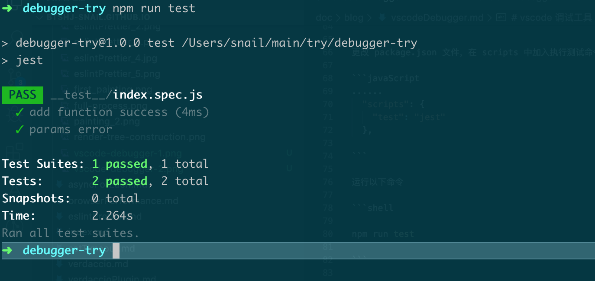
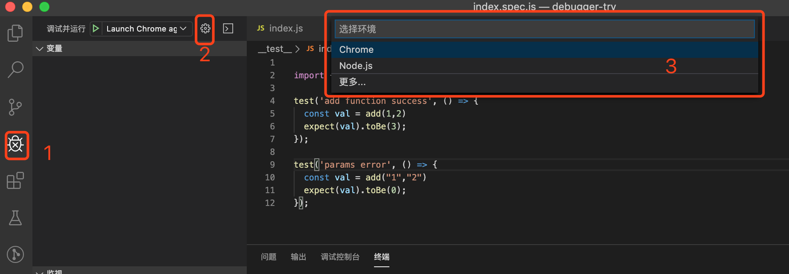
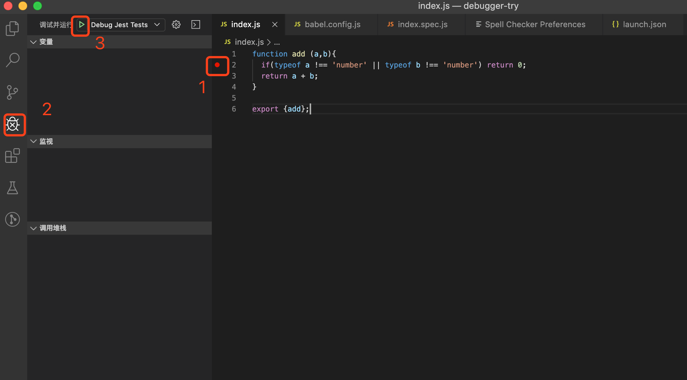
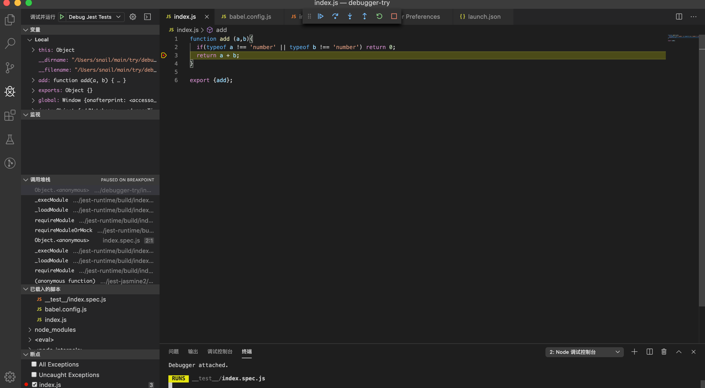

# vscode 调试工具 与 jest 结合

## 背景
原来只是知晓 `vscode` 有调试工具，但是总觉的有浏览器的开发者工具已经完全够用了。但是最近在写 `sdk` 和其他公共工具类，使用 `jest` 的时候才发现， `vscode` 调试工具大有用处。可以方便断点、步进跟踪调试代码。

## 开启调试之旅

### 创建工程

我们新创建一个名字叫 `debugger-try` 的工程，用以实践 `vscode` 的 `debugger` 功能。同时创建 `index.js` 文件，书写一个简单的 `add` 方法，用以测试。

```javaScript
function add (a,b){
  if(typeof a !== 'number' || typeof b !== 'number') return 0;
  return a + b;
}

export {add};
```

同时为了顺便将 `jest` 与 `vscode` 的 `debugger` 功能结合起来，我们在这个工程中引入 `jest` 。

```shell

npm install jest babel-jest @babel/core @babel/preset-env --saev-dev

```

在工程的 `__test__`文件夹中建立一个测试文件，`index.spec.js`.

```javaScript
// index.spec.js

import {add} from '../index'


import {add} from '../index'

test('add function success', () => {
  const val = add(1,2)
  expect(val).toBe(3);
});

test('params error', () => {
  const val = add("1","2")
  expect(val).toBe(0);
});

```

更改 `package.json` 文件，在 `scripts` 中加入执行测试命令动作

```javaScript
......
  "scripts": {
    "test": "jest"
  },

```

运行以下命令

```shell

npm run test

```




### 创建 `vscode` 调试配置文件



按照上图，依次点击 1 ，2 ，3 步骤。

此时会在工程根目录创建 `.vscode` 文件夹，在该文件夹下生成一个 `launch.json` 文件。

该文件则是 `debugger` 的核心文件，它将会指导 `vscode` 的 `debugger` 模块如何运行。

```json

{
  // 使用 IntelliSense 了解相关属性。 
  // 悬停以查看现有属性的描述。
  // 欲了解更多信息，请访问: https://go.microsoft.com/fwlink/?linkid=830387
  "version": "0.2.0",
  "configurations": [
    {
      "type": "node",
      "request": "launch",
      "name": "Debug Jest Tests",
      "url": "http://localhost:8080",
      "webRoot": "${workspaceFolder}"
    }
  ]
}

```

### launch.json 文件

在 `vscode` 中，有两种模式调试模式， `Launch` 和 `Attach` 。对于这两种模式的区别，可以按以下的描述进行理解。

- `launch` : 启动。在 `vscode` 启动应用程序
- `attach` : 附加。 在启动应用程序时，附加启动的应用。

```json

    {
        "version": "0.2.0",
        "configurations": [
            {
                "version": "0.2.0",
                "configurations": [],
                "compounds": []
            },
            {
                // 配置名称，将会在启动配置的下拉菜单中显示
                "name": "Launch Chrome against localhost",
                // 配置类型.chrome/node 等
                "type": "chrome", 
                // 请求配置类型，可以为launch（启动）或attach（附加）                          
                "request": "launch",
                 // 将要进行调试的程序的路径               
                "program": "${workspaceRoot}", 
                // 传递给运行时可执行文件的可选参数。
                "runtimeArgs":[],
                // 程序调试时传递给程序的命令行参数。
                "args": [], 
                // 环境变量
                "env":"",
                // 调试程序时的工作目录，一般为${workspaceRoot}即代码所在目录                       
                "cwd": "${workspaceRoot}",  
                // 端口号
                "port":9527,
                // 使用哪种打印日志 internalConsole  integratedTerminal  externalTerminal
                "console":"internalConsole",
                // 调试时是否显示控制台窗口，一般设置为true显示控制台                
                "externalConsole": true, 
                // 在执行一个任务前开启一个debug session，该值是.vscode文件夹下tasks.json文件中task的name。或者设置${defaultBuildTask}，以使用默认的任务                
                "preLaunchTask": "",
                // 在debug session结束后，执行的任务。该值是.vscode文件夹下tasks.json文件中task的name。
                "postDebugTask":"",
                //控制何时打开内部调试控制台。neverOpen 从不打开 ；openOnFirstSessionStart 在第一次时打开 ； openOnSessionStart 在打开时
                "internalConsoleOptions":"neverOpen",
                // 仅用于debug插件开发者
                "debugServer":""

            }
        ]
    }

```

### 结合`jest`

```json

{
  "version": "0.2.0",
  "configurations": [
    {
      "name": "Debug Jest Tests",
      "timeout": 600000,
      "type": "node",
      "request": "launch",
      "runtimeArgs": ["--inspect-brk", "${workspaceRoot}/node_modules/.bin/jest"],
      "cwd": "${workspaceFolder}",
      "args": ["--runInBand", "--no-watch"],
      "console": "integratedTerminal",
      "internalConsoleOptions": "openOnFirstSessionStart",
      "port": 9229
    }
  ]
}

```

### `debug`

随后和其他`IDE`工具一样，在想要断点的代码处打上断点。



> 注意，一定要先打断点，再启动调试。否则打的断点不生效

进入断点后的效果

