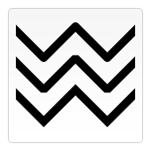

# 色彩 Colors

到目前为止，我们只看到过绘制内容的方法。如果我们想要给图形上色，有两个重要的属性可以做到：fillStyle 和 strokeStyle。

    fillStyle = color //设置图形的填充颜色。
    strokeStyle = color //设置图形轮廓的颜色。
    
color 可以是表示 CSS 颜色值的字符串，渐变对象或者图案对象。我们迟些再回头探讨渐变和图案对象。默认情况下，线条和填充颜色都是黑色（CSS 颜色值 #000000）。

> 注意: 一旦您设置了 strokeStyle 或者 fillStyle 的值，那么这个新值就会成为新绘制的图形的默认值。
如果你要给每个图形上不同的颜色，你需要重新设置 fillStyle 或 strokeStyle 的值。

您输入的应该是符合 CSS3 颜色值标准 的有效字符串。下面的例子都表示同一种颜色。

    // 这些 fillStyle 的值均为 '橙色'
    ctx.fillStyle = "orange";
    ctx.fillStyle = "#FFA500";
    ctx.fillStyle = "rgb(255,165,0)";
    ctx.fillStyle = "rgba(255,165,0,1)";

## fillStyle 示例

在本示例里，我会再度用两层 for 循环来绘制方格阵列，每个方格不同的颜色。
结果如下图，但实现所用的代码却没那么绚丽。我用了两个变量 i 和 j 来为每一个方格产生唯一的 RGB 色彩值，其中仅修改红色和绿色通道的值，而保持蓝色通道的值不变。
你可以通过修改这些颜色通道的值来产生各种各样的色板。通过增加渐变的频率，你还可以绘制出类似 Photoshop 里面的那样的调色板。

```javascript
function draw() {
  var ctx = document.getElementById('canvas').getContext('2d');
  for (var i=0;i<6;i++){
    for (var j=0;j<6;j++){
      ctx.fillStyle = 'rgb(' + Math.floor(255-42.5*i) + ',' + 
                       Math.floor(255-42.5*j) + ',0)';
      ctx.fillRect(j*25,i*25,25,25);
    }
  }
}
```


## strokeStyle 示例

这个示例与上面的有点类似，但这次用到的是 strokeStyle 属性，画的不是方格，而是用 arc 方法来画圆。

```javascript
function draw() {
    var ctx = document.getElementById('canvas').getContext('2d');
    for (var i=0;i<6;i++){
      for (var j=0;j<6;j++){
        ctx.strokeStyle = 'rgb(0,' + Math.floor(255-42.5*i) + ',' + 
                         Math.floor(255-42.5*j) + ')';
        ctx.beginPath();
        ctx.arc(12.5+j*25,12.5+i*25,10,0,Math.PI*2,true);
        ctx.stroke();
      }
    }
  }
```


## 透明度 Transparency

除了可以绘制实色图形，我们还可以用 canvas 来绘制半透明的图形。通过设置 globalAlpha 属性或者使用一个半透明颜色作为轮廓或填充的样式。

globalAlpha = transparencyValue
这个属性影响到 canvas 里所有图形的透明度，有效的值范围是 0.0 （完全透明）到 1.0（完全不透明），默认是 1.0。
globalAlpha 属性在需要绘制大量拥有相同透明度的图形时候相当高效。不过，我认为下面的方法可操作性更强一点。

因为 strokeStyle 和 fillStyle 属性接受符合 CSS 3 规范的颜色值，那我们可以用下面的写法来设置具有透明度的颜色。

    ctx.strokeStyle = "rgba(255,0,0,0.5)";
    ctx.fillStyle = "rgba(255,0,0,0.5)";

## globalAlpha 示例

在这个例子里，将用四色格作为背景，设置 globalAlpha 为 0.2 后，在上面画一系列半径递增的半透明圆。
最终结果是一个径向渐变效果。圆叠加得越更多，原先所画的圆的透明度会越低。通过增加循环次数，画更多的圆，背景图的中心部分会完全消失。

```javascript
function draw() {
  var ctx = document.getElementById('canvas').getContext('2d');
  // 画背景
  ctx.fillStyle = '#FD0';
  ctx.fillRect(0,0,75,75);
  ctx.fillStyle = '#6C0';
  ctx.fillRect(75,0,75,75);
  ctx.fillStyle = '#09F';
  ctx.fillRect(0,75,75,75);
  ctx.fillStyle = '#F30';
  ctx.fillRect(75,75,75,75);
  ctx.fillStyle = '#FFF';

  // 设置透明度值
  ctx.globalAlpha = 0.2;

  // 画半透明圆
  for (var i=0;i<7;i++){
      ctx.beginPath();
      ctx.arc(75,75,10+10*i,0,Math.PI*2,true);
      ctx.fill();
  }
}
```

## rgba() 示例

第二个例子和上面那个类似，不过不是画圆，而是画矩形。这里还可以看出，rgba() 可以分别设置轮廓和填充样式，因而具有更好的可操作性和使用灵活性。

```javascript

function draw() {
  var ctx = document.getElementById('canvas').getContext('2d');

  // 画背景
  ctx.fillStyle = 'rgb(255,221,0)';
  ctx.fillRect(0,0,150,37.5);
  ctx.fillStyle = 'rgb(102,204,0)';
  ctx.fillRect(0,37.5,150,37.5);
  ctx.fillStyle = 'rgb(0,153,255)';
  ctx.fillRect(0,75,150,37.5);
  ctx.fillStyle = 'rgb(255,51,0)';
  ctx.fillRect(0,112.5,150,37.5);

  // 画半透明矩形
  for (var i=0;i<10;i++){
    ctx.fillStyle = 'rgba(255,255,255,'+(i+1)/10+')';
    for (var j=0;j<4;j++){
      ctx.fillRect(5+i*14,5+j*37.5,14,27.5)
    }
  }
}


```


## 线型 Line styles

可以通过一系列属性来设置线的样式。

    lineWidth = value
    //设置线条宽度。
    lineCap = type
    //设置线条末端样式。
    lineJoin = type
    //设定线条与线条间接合处的样式。
    miterLimit = value
    //限制当两条线相交时交接处最大长度；所谓交接处长度（斜接长度）是指线条交接处内角顶点到外角顶点的长度。
    getLineDash()
    //返回一个包含当前虚线样式，长度为非负偶数的数组。
    setLineDash(segments)
    //设置当前虚线样式。
    lineDashOffset = value
    //设置虚线样式的起始偏移量。
    
通过以下的样例可能会更加容易理解。


## lineWidth 属性的例子

这个属性设置当前绘线的粗细。属性值必须为正数。默认值是1.0。

线宽是指给定路径的中心到两边的粗细。换句话说就是在路径的两边各绘制线宽的一半。因为画布的坐标并不和像素直接对应，当需要获得精确的水平或垂直线的时候要特别注意。

在下面的例子中，用递增的宽度绘制了10条直线。最左边的线宽1.0单位。并且，最左边的以及所有宽度为奇数的线并不能精确呈现，这就是因为路径的定位问题。

```javascript

function draw() {
  var ctx = document.getElementById('canvas').getContext('2d');
  for (var i = 0; i < 10; i++){
    ctx.lineWidth = 1+i;
    ctx.beginPath();
    ctx.moveTo(5+i*14,5);
    ctx.lineTo(5+i*14,140);
    ctx.stroke();
  }
}


```

想要获得精确的线条，必须对线条是如何描绘出来的有所理解。见下图，用网格来代表 canvas 的坐标格，每一格对应屏幕上一个像素点。
在第一个图中，填充了 (2,1) 至 (5,5) 的矩形，整个区域的边界刚好落在像素边缘上，这样就可以得到的矩形有着清晰的边缘。


如果你想要绘制一条从 (3,1) 到 (3,5)，宽度是 1.0 的线条，你会得到像第二幅图一样的结果。实际填充区域（深蓝色部分）仅仅延伸至路径两旁各一半像素。而这半个像素又会以近似的方式进行渲染，这意味着那些像素只是部分着色，结果就是以实际笔触颜色一半色调的颜色来填充整个区域（浅蓝和深蓝的部分）。这就是上例中为何宽度为 1.0 的线并不准确的原因。

要解决这个问题，你必须对路径施以更加精确的控制。已知粗 1.0 的线条会在路径两边各延伸半像素，那么像第三幅图那样绘制从 (3.5,1) 到 (3.5,5) 的线条，其边缘正好落在像素边界，填充出来就是准确的宽为 1.0 的线条。

> 注意：在这个竖线的例子中，其Y坐标刚好落在网格线上，否则端点上同样会出现半渲染的像素点（但还要注意，这种行为的表现取决于当前的lineCap风格，它默认为butt；您可能希望通过将lineCap样式设置为square正方形，来得到与奇数宽度线的半像素坐标相一致的笔画，这样，端点轮廓的外边框将被自动扩展以完全覆盖整个像素格）。

> 还请注意，只有路径的起点和终点受此影响：如果一个路径是通过closePath()来封闭的，它是没有起点和终点的；相反的情况下，路径上的所有端点都与上一个点相连，下一段路径使用当前的lineJoin设置（默认为miter），如果相连路径是水平和/或垂直的话，会导致相连路径的外轮廓根据相交点自动延伸，因此渲染出的路径轮廓会覆盖整个像素格。接下来的两个小节将展示这些额外的行样式。

对于那些宽度为偶数的线条，每一边的像素数都是整数，那么你想要其路径是落在像素点之间 (如那从 (3,1) 到 (3,5)) 而不是在像素点的中间。同样，注意到那个例子的垂直线条，其 Y 坐标刚好落在网格线上，如果不是的话，端点上同样会出现半渲染的像素点。

虽然开始处理可缩放的 2D 图形时会有点小痛苦，但是及早注意到像素网格与路径位置之间的关系，可以确保图形在经过缩放或者其它任何变形后都可以保持看上去蛮好：线宽为 1.0 的垂线在放大 2 倍后，会变成清晰的线宽为 2.0，并且出现在它应该出现的位置上。

## lineCap 属性的例子

属性 lineCap 的值决定了线段端点显示的样子。它可以为下面的三种的其中之一：butt，round 和 square。默认是 butt。

在这个例子里面，我绘制了三条直线，分别赋予不同的 lineCap 值。还有两条辅助线，为了可以看得更清楚它们之间的区别，三条线的起点终点都落在辅助线上。

最左边的线用了默认的 butt 。可以注意到它是与辅助线齐平的。中间的是 round 的效果，端点处加上了半径为一半线宽的半圆。右边的是 square 的效果，端点处加上了等宽且高度为一半线宽的方块。


```javaScript

function draw() {
  var ctx = document.getElementById('canvas').getContext('2d');
  var lineCap = ['butt','round','square'];

  // 创建路径
  ctx.strokeStyle = '#09f';
  ctx.beginPath();
  ctx.moveTo(10,10);
  ctx.lineTo(140,10);
  ctx.moveTo(10,140);
  ctx.lineTo(140,140);
  ctx.stroke();

  // 画线条
  ctx.strokeStyle = 'black';
  for (var i=0;i<lineCap.length;i++){
    ctx.lineWidth = 15;
    ctx.lineCap = lineCap[i];
    ctx.beginPath();
    ctx.moveTo(25+i*50,10);
    ctx.lineTo(25+i*50,140);
    ctx.stroke();
  }
}

```

## lineJoin 属性的例子

lineJoin 的属性值决定了图形中两线段连接处所显示的样子。它可以是这三种之一：round, bevel 和 miter。默认是 miter。

这里我同样用三条折线来做例子，分别设置不同的 lineJoin 值。最上面一条是 round 的效果，边角处被磨圆了，圆的半径等于线宽。中间和最下面一条分别是 bevel 和 miter 的效果。当值是 miter 的时候，线段会在连接处外侧延伸直至交于一点，延伸效果受到下面将要介绍的 miterLimit 属性的制约。



```javaScript

function draw() {
  var ctx = document.getElementById('canvas').getContext('2d');
  var lineJoin = ['round','bevel','miter'];
  ctx.lineWidth = 10;
  for (var i=0;i<lineJoin.length;i++){
    ctx.lineJoin = lineJoin[i];
    ctx.beginPath();
    ctx.moveTo(-5,5+i*40);
    ctx.lineTo(35,45+i*40);
    ctx.lineTo(75,5+i*40);
    ctx.lineTo(115,45+i*40);
    ctx.lineTo(155,5+i*40);
    ctx.stroke();
  }
}

```

## miterLimit 属性的演示例子

就如上一个例子所见的应用 miter 的效果，线段的外侧边缘会延伸交汇于一点上。线段直接夹角比较大的，交点不会太远，但当夹角减少时，交点距离会呈指数级增大。

miterLimit 属性就是用来设定外延交点与连接点的最大距离，如果交点距离大于此值，连接效果会变成了 bevel。


