# 组合 Compositing

在之前的例子里面，我们总是将一个图形画在另一个之上，对于其他更多的情况，仅仅这样是远远不够的。比如，对合成的图形来说，绘制顺序会有限制。不过，我们可以利用 globalCompositeOperation 属性来改变这种状况。此外, clip属性允许我们隐藏不想看到的部分图形.

## globalCompositeOperation

我们不仅可以在已有图形后面再画新图形，还可以用来遮盖指定区域，清除画布中的某些部分（清除区域不仅限于矩形，像clearRect()方法做的那样 ）以及更多其他操作。

**globalCompositeOperation = type**

这个属性设定了在画新图形时采用的遮盖策略，其值是一个标识12种遮盖方式的字符串。

### source-over

This is the default setting and draws new shapes on top of the existing canvas content.（这个是默认设置。新画的形状在已存在的图形上方。）

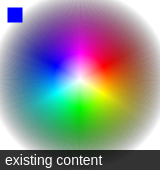

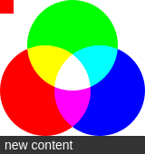

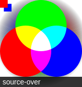

### source-in

The new shape is drawn only where both the new shape and the destination canvas overlap. Everything else is made transparent.（新形状只有在新形状和目标画布重叠的地方才绘制。其他一切都是透明）


### source-out

The new shape is drawn where it doesn't overlap the existing canvas content.(在不重叠现有画布内容的地方绘制新的形状)


### source-atop

The new shape is only drawn where it overlaps the existing canvas content.(新图形只在与现有画布重叠的地方绘制)


### destination-over

New shapes are drawn behind the existing canvas content.(新的形状被绘制在现有的画布内容后面)


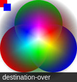

### destination-in

The existing canvas content is kept where both the new shape and existing canvas content overlap. Everything else is made transparent.(现有的画布内容保持在新的形状和现有的画布重叠的地方。其他一起都是透明的)


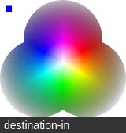

### destination-out

The existing content is kept where it doesn't overlap the new shape.(现有的内容保留在不重叠新形状的地方)


### destination-atop

The existing canvas is only kept where it overlaps the new shape. The new shape is drawn behind the canvas content.（现有的画布只保留与新图形重叠的地方。新的形状被绘制在画布的内容后面）


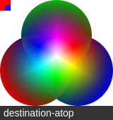

### lighter

Where both shapes overlap the color is determined by adding color values.（在两种形状重叠的地方，颜色是通过添加颜色值来确定的）


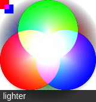

### copy

Only the new shape is shown.


### xor

Shapes are made transparent where both overlap and drawn normal everywhere else.（重叠部分透明）


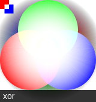

### multiply

The pixels are of the top layer are multiplied with the corresponding pixel of the bottom layer. A darker picture is the result.（顶层的像素与底层的相应像素相乘。一般来说会更暗）


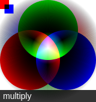

### screen

The pixels are inverted, multiplied, and inverted again. A lighter picture is the result (opposite of multiply)（像素被倒转，放大和再次倒转。一般来说会亮一些）


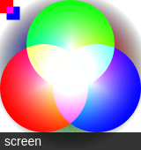

### overlay

A combination of multiply and screen. Dark parts on the base layer become darker, and light parts become lighter.（multiply和screen模式的组合。暗的地方变的更暗，亮的地方变的更亮）


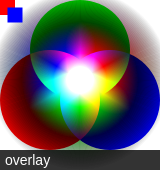

### darken

Retains the darkest pixels of both layers.（保留两层最暗的像素）


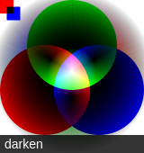

### lighten

Retains the lightest pixels of both layers.（保留两层最亮的像素）


### color-dodge

Divides the bottom layer by the inverted top layer.()


## 裁切路径 Clipping paths

裁切路径和普通的 canvas 图形差不多，不同的是它的作用是遮罩，用来隐藏不需要的部分。如右图所示。红边五角星就是裁切路径，所有在路径以外的部分都不会在 canvas 上绘制出来。

如果和上面介绍的 globalCompositeOperation 属性作一比较，它可以实现与 source-in 和 source-atop 差不多的效果。最重要的区别是裁切路径不会在 canvas 上绘制东西，而且它永远不受新图形的影响。这些特性使得它在特定区域里绘制图形时相当好用。

在  一章中，我只介绍了 stroke 和 fill 方法，这里介绍第三个方法 clip。

**clip()**
Turns the path currently being built into the current clipping path.

我们使用 clip() 方法来创建一个新的裁切路径。

默认情况下，canvas 有一个与它自身一样大的裁切路径（也就是没有裁切效果）。

### clip 的例子

这个例子，我会用一个圆形的裁切路径来限制随机星星的绘制区域。

```javaScript
function draw() {
  var ctx = document.getElementById('canvas').getContext('2d');
  ctx.fillRect(0,0,150,150);
  ctx.translate(75,75);

  // Create a circular clipping path
  ctx.beginPath();
  ctx.arc(0,0,60,0,Math.PI*2,true);
  ctx.clip();

  // draw background
  var lingrad = ctx.createLinearGradient(0,-75,0,75);
  lingrad.addColorStop(0, '#232256');
  lingrad.addColorStop(1, '#143778');
  
  ctx.fillStyle = lingrad;
  ctx.fillRect(-75,-75,150,150);

  // draw stars
  for (var j=1;j<50;j++){
    ctx.save();
    ctx.fillStyle = '#fff';
    ctx.translate(75-Math.floor(Math.random()*150),
                  75-Math.floor(Math.random()*150));
    drawStar(ctx,Math.floor(Math.random()*4)+2);
    ctx.restore();
  }
  
}
function drawStar(ctx,r){
  ctx.save();
  ctx.beginPath()
  ctx.moveTo(r,0);
  for (var i=0;i<9;i++){
    ctx.rotate(Math.PI/5);
    if(i%2 == 0) {
      ctx.lineTo((r/0.525731)*0.200811,0);
    } else {
      ctx.lineTo(r,0);
    }
  }
  ctx.closePath();
  ctx.fill();
  ctx.restore();
}
```

首先，我画了一个与 canvas 一样大小的黑色方形作为背景，然后移动原点至中心点。然后用 clip 方法创建一个弧形的裁切路径。裁切路径也属于 canvas 状态的一部分，可以被保存起来。如果我们在创建新裁切路径时想保留原来的裁切路径，我们需要做的就是保存一下 canvas 的状态。

裁切路径创建之后所有出现在它里面的东西才会画出来。在画线性渐变时我们就会注意到这点。然后会绘制出50 颗随机位置分布（经过缩放）的星星，当然也只有在裁切路径里面的星星才会绘制出来。

