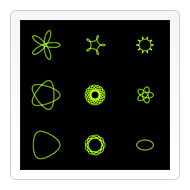
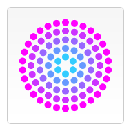

# 变形

在本教程的旧版本中，我们已经了解了Canvas网格和坐标空间。到目前为止，我们只是根据我们的需要使用默认的网格，改变整个画布的大小。随着变形有更强大的方法来实现起点到另一点的变换，旋转栅格甚至缩放。

## 状态的保存和恢复 Saving and restoring state

在了解变形之前，我先介绍两个在你开始绘制复杂图形时必不可少的方法。

**save()**

**restore()**

save 和 restore 方法是用来保存和恢复 canvas 状态的，都没有参数。Canvas 的状态就是当前画面应用的所有样式和变形的一个快照。

Canvas状态存储在栈中，每当save()方法被调用后，当前的状态就被推送到栈中保存。一个绘画状态包括：

- 当前应用的变形（即移动，旋转和缩放，见下）
- strokeStyle, fillStyle, globalAlpha, lineWidth, lineCap, lineJoin, miterLimit, shadowOffsetX, shadowOffsetY, shadowBlur, shadowColor, globalCompositeOperation 的值
- 当前的裁切路径（clipping path），会在下一节介绍

你可以调用任意多次 save 方法。

每一次调用 restore 方法，上一个保存的状态就从栈中弹出，所有设定都恢复。

## save 和 restore 的应用例子

我们尝试用这个连续矩形的例子来描述 canvas 的状态栈是如何工作的。

第一步是用默认设置画一个大四方形，然后保存一下状态。改变填充颜色画第二个小一点的蓝色四方形，然后再保存一下状态。再次改变填充颜色绘制更小一点的半透明的白色四方形。

到目前为止所做的动作和前面章节的都很类似。不过一旦我们调用 restore，状态栈中最后的状态会弹出，并恢复所有设置。如果不是之前用 save 保存了状态，那么我们就需要手动改变设置来回到前一个状态，这个对于两三个属性的时候还是适用的，一旦多了，我们的代码将会猛涨。

当第二次调用 restore 时，已经恢复到最初的状态，因此最后是再一次绘制出一个黑色的四方形。

```javaScript

function draw() {
  var ctx = document.getElementById('canvas').getContext('2d');

  ctx.fillRect(0,0,150,150);   // 使用默认设置绘制一个矩形
  ctx.save();                  // 保存默认状态

  ctx.fillStyle = '#09F'       // 在原有配置基础上对颜色做改变
  ctx.fillRect(15,15,120,120); // 使用新的设置绘制一个矩形
  ctx.save();                  // 保存当前状态

  ctx.fillStyle = '#FFF'       // 再次改变颜色配置
  ctx.globalAlpha = 0.5;
  ctx.fillRect(30,30,90,90);   // 使用新的配置绘制一个矩形

  ctx.restore();               // 重新加载之前的颜色状态
  ctx.fillRect(45,45,60,60);   // 使用上一次的配置绘制一个矩形

  ctx.restore();               // 加载默认颜色配置
  ctx.fillRect(60,60,30,30);   // 使用加载的配置绘制一个矩形
}

```

## 移动 Translating

我们先介绍 translate 方法，它用来移动 canvas 和它的原点到一个不同的位置。

**translate(x, y)**

translate 方法接受两个参数。x 是左右偏移量，y 是上下偏移量，如右图所示。

在做变形之前先保存状态是一个良好的习惯。大多数情况下，调用 restore 方法比手动恢复原先的状态要简单得多。又，如果你是在一个循环中做位移但没有保存和恢复 canvas 的状态，很可能到最后会发现怎么有些东西不见了，那是因为它很可能已经超出 canvas 范围以外了。

## translate 的例子

这个例子显示了一些移动 canvas 原点的好处。我创建了一个 drawSpirograph 方法用来绘制螺旋（spirograph）图案，那是围绕原点绘制出来的。如果不使用 translate 方法，那么只能看见其中的四分之一。translate 同时让我可以任意放置这些图案，而不需要在 spirograph 方法中手工调整坐标值，既好理解也方便使用。

我在 draw 方法中调用 drawSpirograph 方法 9 次，用了 2 层循环。每一次循环，先移动 canvas ，画螺旋图案，然后恢复早原始状态。

```javaScript
function draw() {
  var ctx = document.getElementById('canvas').getContext('2d');
  ctx.fillRect(0,0,300,300);
  for (var i=0;i<3;i++) {
    for (var j=0;j<3;j++) {
      ctx.save();
      ctx.strokeStyle = "#9CFF00";
      ctx.translate(50+j*100,50+i*100);
      drawSpirograph(ctx,20*(j+2)/(j+1),-8*(i+3)/(i+1),10);
      ctx.restore();
    }
  }
}
function drawSpirograph(ctx,R,r,O){
  var x1 = R-O;
  var y1 = 0;
  var i  = 1;
  ctx.beginPath();
  ctx.moveTo(x1,y1);
  do {
    if (i>20000) break;
    var x2 = (R+r)*Math.cos(i*Math.PI/72) - (r+O)*Math.cos(((R+r)/r)*(i*Math.PI/72))
    var y2 = (R+r)*Math.sin(i*Math.PI/72) - (r+O)*Math.sin(((R+r)/r)*(i*Math.PI/72))
    ctx.lineTo(x2,y2);
    x1 = x2;
    y1 = y2;
    i++;
  } while (x2 != R-O && y2 != 0 );
  ctx.stroke();
}
```


## 旋转 Rotating

第二个介绍 rotate 方法，它用于以原点为中心旋转 canvas。

**rotate(angle)**

这个方法只接受一个参数：旋转的角度(angle)，它是顺时针方向的，以弧度为单位的值。
旋转的中心点始终是 canvas 的原点，如果要改变它，我们需要用到 translate 方法。

## rotate 的例子

在这个例子里，见下图，我用 rotate 方法来画圆并构成圆形图案。当然你也可以分别计算出 x 和 y 坐标（x = r*Math.cos(a); y = r*Math.sin(a)）。这里无论用什么方法都无所谓的，因为我们画的是圆。计算坐标的结果只是旋转圆心位置，而不是圆本身。即使用 rotate 旋转两者，那些圆看上去还是一样的，不管它们绕中心旋转有多远。

这里我们又用到了两层循环。第一层循环决定环的数量，第二层循环决定每环有多少个点。每环开始之前，我都保存一下 canvas 的状态，这样恢复起来方便。每次画圆点，我都以一定夹角来旋转 canvas，而这个夹角则是由环上的圆点数目的决定的。最里层的环有 6 个圆点，这样，每次旋转的夹角就是 360/6 = 60 度。往外每一环的圆点数目是里面一环的 2 倍，那么每次旋转的夹角随之减半。



```javaScript
function draw() {
  var ctx = document.getElementById('canvas').getContext('2d');
  ctx.translate(75,75);

  for (var i=1;i<6;i++){ // Loop through rings (from inside to out)
    ctx.save();
    ctx.fillStyle = 'rgb('+(51*i)+','+(255-51*i)+',255)';

    for (var j=0;j<i*6;j++){ // draw individual dots
      ctx.rotate(Math.PI*2/(i*6));
      ctx.beginPath();
      ctx.arc(0,i*12.5,5,0,Math.PI*2,true);
      ctx.fill();
    }

    ctx.restore();
  }
}
```

## 缩放 Scaling

接着是缩放。我们用它来增减图形在 canvas 中的像素数目，对形状，位图进行缩小或者放大。

**scale(x, y)**

scale 方法接受两个参数。x,y 分别是横轴和纵轴的缩放因子，它们都必须是正值。值比 1.0 小表示缩小，比 1.0 大则表示放大，值为 1.0 时什么效果都没有。
默认情况下，canvas 的 1 单位就是 1 个像素。举例说，如果我们设置缩放因子是 0.5，1 个单位就变成对应 0.5 个像素，这样绘制出来的形状就会是原先的一半。同理，设置为 2.0 时，1 个单位就对应变成了 2 像素，绘制的结果就是图形放大了 2 倍。

这最后的例子里，我再次启用前面曾经用过的 spirograph 方法，来画 9 个图形，分别赋予不同的缩放因子。左上角的图形是未经缩放的。黄色图案从左到右应用了统一的缩放因子（x 和 y 参数值是一致的）。看下面的代码，你可以发现，我在画第二第三个图案时 scale 了两次，中间没有 restore canvas 的状态，因此第三个图案的缩放因子其实是 0.75 × 0.75 = 0.5625。

第二行蓝色图案堆垂直方向应用了不统一的缩放因子，每个图形 x 方向上的缩放因子都是 1.0，意味着不缩放，而 y 方向缩放因子是 0.75，得出来的结果是，图案被依次压扁了。原来的圆形图案变成了椭圆，如果细心观察，还可以发现在垂直方向上的线宽也减少了。

第三行的绿色图案与第二行类似，只不过我们在横轴方向上施加了缩放。

```javaScript

function draw() {
  var ctx = document.getElementById('canvas').getContext('2d');
  ctx.strokeStyle = "#fc0";
  ctx.lineWidth = 1.5;
  ctx.fillRect(0,0,300,300);

  // Uniform scaling
  ctx.save()
  ctx.translate(50,50);
  drawSpirograph(ctx,22,6,5);  // no scaling

  ctx.translate(100,0);
  ctx.scale(0.75,0.75);
  drawSpirograph(ctx,22,6,5);

  ctx.translate(133.333,0);
  ctx.scale(0.75,0.75);
  drawSpirograph(ctx,22,6,5);
  ctx.restore();

  // Non-uniform scaling (y direction)
  ctx.strokeStyle = "#0cf";
  ctx.save()
  ctx.translate(50,150);
  ctx.scale(1,0.75);
  drawSpirograph(ctx,22,6,5);

  ctx.translate(100,0);
  ctx.scale(1,0.75);
  drawSpirograph(ctx,22,6,5);

  ctx.translate(100,0);
  ctx.scale(1,0.75);
  drawSpirograph(ctx,22,6,5);
  ctx.restore();

  // Non-uniform scaling (x direction)
  ctx.strokeStyle = "#cf0";
  ctx.save()
  ctx.translate(50,250);
  ctx.scale(0.75,1);
  drawSpirograph(ctx,22,6,5);

  ctx.translate(133.333,0);
  ctx.scale(0.75,1);
  drawSpirograph(ctx,22,6,5);

  ctx.translate(177.777,0);
  ctx.scale(0.75,1);
  drawSpirograph(ctx,22,6,5);
  ctx.restore();
  
}

```

## 变形 Transforms

最后一个方法允许对变形矩阵直接修改。

**transform(m11, m12, m21, m22, dx, dy)**

这个方法是将当前的变形矩阵乘上一个基于自身参数的矩阵，在这里我们用下面的矩阵：

    m11 m21 dx
    m12 m22 dy
    0 	0 	1

如果任意一个参数是无限大，变形矩阵也必须被标记为无限大，否则会抛出异常。

这个函数的参数各自代表如下：

m11：水平方向的缩放

m12：水平方向的偏移

m21：竖直方向的偏移

m22：竖直方向的缩放

dx：水平方向的移动

dy：竖直方向的移动

**setTransform(m11, m12, m21, m22, dx, dy)**

这个方法会将当前的变形矩阵重置为单位矩阵，然后用相同的参数调用 transform 方法。如果任意一个参数是无限大，那么变形矩阵也必须被标记为无限大，否则会抛出异常。从根本上来说，该方法是取消了当前变形,然后设置为指定的变形,一步完成。

**resetTransform()**

重置当前变形为单位矩阵，它和调用以下语句是一样的：

ctx.setTransform(1, 0, 0, 1, 0, 0);

## transform / setTransform 的例子

```javaScript
function draw() {
  var ctx = document.getElementById('canvas').getContext('2d');

  var sin = Math.sin(Math.PI/6);
  var cos = Math.cos(Math.PI/6);
  ctx.translate(100, 100);
  var c = 0;
  for (var i=0; i <= 12; i++) {
    c = Math.floor(255 / 12 * i);
    ctx.fillStyle = "rgb(" + c + "," + c + "," + c + ")";
    ctx.fillRect(0, 0, 100, 10);
    ctx.transform(cos, sin, -sin, cos, 0, 0);
  }
  
  ctx.setTransform(-1, 0, 0, 1, 100, 100);
  ctx.fillStyle = "rgba(255, 128, 255, 0.5)";
  ctx.fillRect(0, 50, 100, 100);
}
```