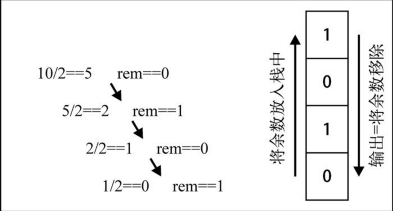

# 栈

栈是一种后进先出(LIFO)原则的有序集合。新添加的或待删除的元素都保存在栈的同一端，称为栈顶，另一端叫做栈底。在栈里新元素接近于栈顶，旧元素接近于栈底。

栈一般在编程语言的编译器和内存中保存变量、方法调用等。

## 创建栈

我们将创建一个类，来表示栈。

```javaScript

function Stack(){
    this.items = [];
}

Stack.prototype.push = function(){
    this.items.push.apply(this.items,arguments);
}

Stack.prototype.pop = function(){
    return this.items.pop();
}

Stack.prototype.peek = function(){
    return this.items[this.items.length-1];
}

Stack.prototype.isEmpty = function(){
    return this.items.length===0;
}

Stack.prototype.size = function(){
    return this.items.length;
}

Stack.prototype.clear = function(){
    this.items = [];
}

Stack.prototype.print = function(){
    console.log(this.items.toString());
}

//运用
let stack = new Stack();
console.log(stack.isEmpty());//true
stack.push(1);
stack.push(2);
console.log(stack.peek());//2
stack.push(3);
console.log(stack.size());//3
console.log(stack.pop());//3
console.log(stack.size());//2
stack.clear();
console.log(stack.isEmpty());//true

```

## 用ES6的方式创建Stack类

```javaScript

class Stack{
    constructor(){
        this.items = [];
    }

    push(){
        this.items.push.apply(this.items,arguments);
    }

    pop(){
        return this.items.pop();
    }

    peek(){
        return this.items[this.items.length-1];
    }

    isEmpty(){
        return this.items.length===0;
    }

    size(){
        return this.items.length;
    }

    clear(){
        this.items = [];
    }

    print(){
        console.log(this.items.toString());
    }

}

```

尽管代码看起来更加简洁，漂亮，但是变量items确实公有的。ES6的类是基于原型的。虽然基于原型的类，比基于函数的类更加节约内存，但是不能声明私有属性和方法。而且在这种情况下，我们不希望用户能够访问到items，因为这样用户就能随意改动items中任意位置的元素，从而失去了栈的基本功能；

下面尝试在ES6中创建私有属性：

 ### 用ES6的限定作用于Symbol实现类

ES6实现了一种基本类型，Symbol，它是不可变的，可以用作对象的属性。看看怎么用它，在Stack类中来声明items属性。

 ```javaScript

let _items = Symbol();

class Stack{
    constructor(){
        this[_items] = [];
    }

    //stack其他方法
}


 ```

这种方法创建了一个假的私有属性，因为ES6新增的Object.getOwnPropertySymbols方法能够取到类里面声明的所有Symbols属性。下面是一个破坏Stack类的例子：

```javaScript

let stack = new Stack(); 
stack.push( 5);
stack.push( 8);
let objectSymbols = Object.getOwnPropertySymbols( stack);
console.log( objectSymbols.length);// 1 
console.log( objectSymbols); // [Symbol()] 
console.log( objectSymbols[ 0]); // Symbol() 
stack[ objectSymbols[ 0]]. push( 1); 
stack.print(); // 输 出 5, 8, 1

```

从以上代码可以看到，访问stack[objectSymbols[0]]是可以得到_items的。并且，_items属性是一个数组，可以进行任意的数组操作，比如从中间删除或添加元素。我们操作的是栈，不应该出现这种行为。

### 用ES6的WeakMap实现类

有一种类型可以保证是私有的，就是WeakMap。WeakMap可以存储键值对，其中键是对象，值可以任意数据类型。
如果用WeakMap来存储items，Stack类就应该是这样的：

```javaScript
let Stack = (function(){

    const weakMap = new WeakMap();

    let _getItems = (key)=>{
        return weakMap.get(key);
    }

    let _setItems = (key,val)=>{
        return weakMap.set(key,val);
    }

    return class{

    constructor(){
        _setItems(this,[]);
    }

    push(){
        let s = _getItems(this);
        s.push.apply(s,arguments);
    }
    peek(){
        let s = _getItems(this);
        return s[s.length-1];
    }
    pop(){
        let s = _getItems(this);
        return s.pop();
    }
    isEmpty(){
        let s = _getItems(this);
        return s.length===0;
    }
};
})()


```

事实上，尽管ES6引入了类的语法，我们仍然不能像在其他编程语言中一样声明私有属性或方法。有很多种方法都可以达到相同的效果，但无论是语法还是性能，这些方法都有各自的优点和缺点。哪种方法更好？这取决于你在实际项目中如何使用这些算法，要处理的数据量，要创建的实例个数，以及其他约束条件。最终，还是取决于你。

## 用栈解决问题

### 从十进制到二进制

现实生活中，我们主要使用十进制。但在计算科学中，二进制非常重要，因为计算机里的所有内容都是用二进制数字表示的（0和1）。没有十进制和二进制相互转化的能力，与计算机交流就很困难。

要把十进制转化成二进制，我们可以将该十进制数字和2整除（二进制是满二进一），直到结果是0为止。

举个例子，把十进制的数字10转化成二进制的数字，过程大概是这样：



下面是对应的算法描述：

```javaScript

function divideBy2(decNumber){

    let stack = new Stack(),temp,result='';

    while(decNumber>0){
        temp = Math.floor(decNumber%2);
        stack.push(temp);
        decNumber = Math.floor(decNumber/2);
    }

    while(!stack.isEmpty()){
        result += stack.pop().toString();
    }

    return result; 

    }


console.log(divideBy2(8))
```
在这个基础上，我们很容易将上面的函数改造成十进制转常用进制（2,8,16）的通用方法。

```javaScript

function baseConverter(decNumber,baseNumber){

    let stack = new Stack(),temp,result='',digits = "0123456789ABCDEF";

    while(decNumber>0){
        temp = Math.floor(decNumber%baseNumber);
        stack.push(temp);
        decNumber = Math.floor(decNumber/baseNumber);
    }

    while(!stack.isEmpty()){
        result += digits[stack.pop()];
    }

    return result; 

    }

console.log(baseConverter(13,2))
console.log(baseConverter(13,8))
console.log(baseConverter(13,16))
```