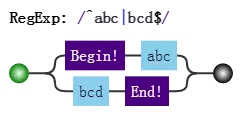
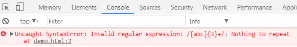
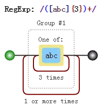

# 正则表达式的拆分

对于一门语言的掌握程度怎么样，可以有两个角度来衡量：读和写。不仅要求自己能解决问题，还要看懂别人的解决方案。代码是这样，正则表达式也是这样。正则这门语言跟其他语言有一点不同，它通常就是一大堆字符，而没有所谓“语句”的概念。如何能正确地把一大串正则拆分成一块一块的，成为了破解“天书”的关键。

本章就解决这一问题，内容包括：

- 结构和操作符
- 注意要点
- 案例分析


## 1. 结构和操作符

编程语言一般都有操作符。只要有操作符，就会出现一个问题。当一大堆操作在一起时，先操作谁，又后操作谁呢？为了不产生歧义，就需要语言本身定义好操作顺序，即所谓的优先级。

而在正则表达式中，操作符都体现在结构中，即由特殊字符和普通字符所代表的一个个特殊整体。

JS正则表达式中，都有哪些结构呢？

> 字符字面量、字符组、量词、锚字符、分组、选择分支、反向引用。

具体含义简要回顾如下（如懂，可以略去不看）：

> - **字面量**，匹配一个具体字符，包括不用转义的和需要转义的。比如a匹配字符"a"，又比如\n匹配换行符，又比如\.匹配小数点
- **字符组**，匹配一个字符，可以是多种可能之一，比如[0-9]，表示匹配一个数字。也有\d的简写形式。另外还有反义字符组，表示可以是除了特定字符之外任何一个字符，比如[^0-9]，表示一个非数字字符，也有\D的简写形式。
- **量词**，表示一个字符连续出现，比如a{1,3}表示“a”字符连续出现3次。另外还有常见的简写形式，比如a+表示“a”字符连续出现至少一次。
- **锚点**，匹配一个位置，而不是字符。比如^匹配字符串的开头，又比如\b匹配单词边界，又比如(?=\d)表示数字前面的位置。
- **分组**，用括号表示一个整体，比如(ab)+，表示"ab"两个字符连续出现多次，也可以使用非捕获分组(?:ab)+。
- **分支**，多个子表达式多选一，比如abc|bcd，表达式匹配"abc"或者"bcd"字符子串。
- **反向引用**，比如\2，表示引用第2个分组。


其中涉及到的操作符有：

> 1. 转义符 \ 
2. 括号和方括号 (...)、(?:...)、(?=...)、(?!...)、[...] 
3. 量词限定符 {m}、{m,n}、{m,}、?、*、+ 
4. 位置和序列 ^ 、$、 \元字符、 一般字符 
5. 管道符（竖杠）|  

上面操作符的优先级从上至下，由高到低。

这里，我们来分析一个正则：

    /ab?(c|de*)+|fg/

- 1. 由于括号的存在，所以， `(c|de*)` 是一个整体结构。
- 2. 在 `(c|de*)` 中，注意其中的量词 `*`，因此 `e*` 是一个整体结构。
- 3. 又因为分支结构“|”优先级最低，因此c是一个整体、而de*是另一个整体。
- 4. 同理，整个正则分成了 `a`、`b?`、`(...)+`、`f`、`g`。而由于分支的原因，又可以分成`ab?(c|de*)+`和`fg`这两部分。

上面的分析可用其可视化形式描述如下：


## 2. 注意要点

关于结构和操作符，还是有几点需要强调：

### 2.1 匹配字符串整体问题

因为是要匹配整个字符串，我们经常会在正则前后中加上锚字符`^`和`$`。

比如要匹配目标字符串"abc"或者"bcd"时，如果一不小心，就会写成`/^abc|bcd$/`。

而位置字符和字符序列优先级要比竖杠高，故其匹配的结构是：



应该修改为：


### 2.2 量词连缀问题

假设，要匹配这样的字符串：

- 每个字符为a、b、c任选其一

- 字符串的长度是3的倍数

此时正则不能想当然地写成`/^[abc]{3}+$/`，这样会报错，说+前面没什么可重复的：



此时要修改成：



### 2.3 元字符转义问题

所谓元字符，就是正则中有特殊含义的字符。所有结构里，用到的元字符总结如下：

> ^ $ . * + ? | \ / ( ) [ ] { } = ! : - ,

当匹配上面的字符本身时，可以一律转义：

```javaScript

var string = "^$.*+?|\\/[]{}=!:-,";
var regex = /\^\$\.\*\+\?\|\\\/\[\]\{\}\=\!\:\-\,/;
console.log( regex.test(string) ); 
// => true

```
其中`string`中的`\`字符也要转义的。另外，在`string`中，也可以把每个字符转义，当然，转义后的结果仍是本身：


```javaScript

var string = "^$.*+?|\\/[]{}=!:-,";
var string2 = "\^\$\.\*\+\?\|\\\/\[\]\{\}\=\!\:\-\,";
console.log( string == string2 ); 
// => true

```
现在的问题是，是不是每个字符都需要转义呢？否，看情况。

#### 字符组中的元字符

跟字符组相关的元字符有[]、^、-。因此在会引起歧义的地方进行转义。例如开头的^必须转义，不然会把整个字符组，看成反义字符组。

```javaScript

var string = "^$.*+?|\\/[]{}=!:-,";
var regex = /[\^$.*+?|\\/\[\]{}=!:\-,]/g;
console.log( string.match(regex) );
// => ["^", "$", ".", "*", "+", "?", "|", "\", "/", "[", "]", "{", "}", "=", "!", ":", "-", ","]


```

#### 2.3.2 匹配“[abc]”和“{3,5}”

我们知道`[abc]`，是个字符组。如果要匹配字符串"[abc]"时，该怎么办？

可以写成`/\[abc\]/`，也可以写成`/\[abc]/`，测试如下：

```javaScript
var string = "[abc]";
var regex = /\[abc]/g;
console.log( string.match(regex)[0] ); 
// => "[abc]"
```

#### 2.3.3 其余情况

比如= ! : - ,等符号，只要不在特殊结构中，也不需要转义。

但是，括号需要前后都转义的，如/\(123\)/。

至于剩下的^ $ . * + ? | \ /等字符，只要不在字符组内，都需要转义的。

## 3. 案例分析

### 身份证

正则表达式是：

```javaScript

/^\d{17}[\dxX]$/

```
### IPV4


```javaScript

/^((\d|[1-9]\d|1\d\d|2[0-5]{2}).){3}(\d|[1-9]\d|1\d\d|2[0-5]{2})$/.test("255.255.255.255")

```

---

本文来自 JS正则表达式完整教程（略长）[https://juejin.im/post/5965943ff265da6c30653879]
