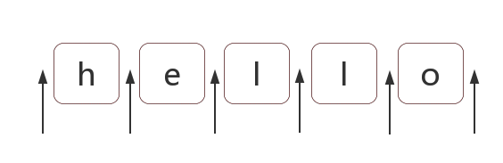

# 正则表达式位置匹配攻略

正则表达式是匹配模式，要么匹配字符，要么匹配位置。请记住这句话。

然而大部分人学习正则时，对于匹配位置的重视程度没有那么高。

本章讲讲正则匹配位置的总总。

内容包括：

- 什么是位置？
- 如何匹配位置？
- 位置的特性
- 几个应用实例分析

## 1.什么是位置

位置是相邻字符之间的位置。比如，下图中箭头所指的地方：



## 2.如何匹配位置

在ES5中，共有6个锚字符：

> ^ $ \b \B (?=p) (?!p)

### 2.1 ^和$

^（脱字符）匹配开头，在多行匹配中匹配行开头。

$（美元符号）匹配结尾，在多行匹配中匹配行结尾。

比如我们把字符串的开头和结尾用"#"替换（位置可以替换成字符的！）：

```javaScript

var result = "hello".replace(/^|$/g, '#');
console.log(result); 
// => "#hello#"

```