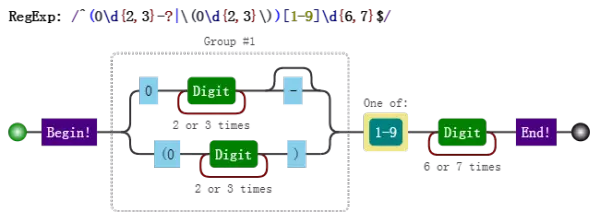
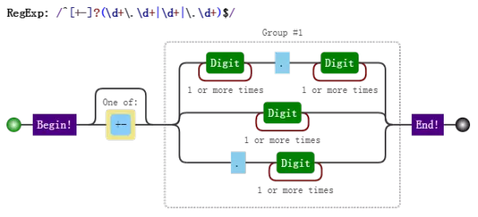

# 正则表达式的构建

对于一门语言的掌握程度怎么样，可以有两个角度来衡量：读和写。不仅要看懂别人的解决方案，也要能独立地解决问题。代码是这样，正则表达式也是这样。与“读”相比，“写”往往更为重要，这个道理是不言而喻的。对正则的运用，首重就是：如何针对问题，构建一个合适的正则表达式？本章就解决该问题，内容包括：

- 平衡法则
- 构建正则前提
- 准确性
- 效率

## 1. 平衡法则

构建正则有一点非常重要，需要做到下面几点的平衡：

- 匹配预期的字符串
- 不匹配非预期的字符串
- 可读性和可维护性
- 效率

## 2. 构建正则前提

### 2.1 是否能使用正则

正则太强大了，以至于我们随便遇到一个操作字符串问题时，都会下意识地去想，用正则该怎么做。但我们始终要提醒自己，正则虽然强大，但不是万能的，很多看似很简单的事情，还是做不到的。比如匹配这样的字符串：1010010001....虽然很有规律，但是只靠正则就是无能为力。

### 2.2 是否有必要使用正则

要认识到正则的局限，不要去研究根本无法完成的任务。同时，也不能走入另一个极端：无所不用正则。能用字符串API解决的简单问题，就不该正则出马。

比如，从日期中提取出年月日，虽然可以使用正则：

```javaScript
var string = "2017-07-01";
var regex = /^(\d{4})-(\d{2})-(\d{2})/;
console.log( string.match(regex) );
```
其实，可以使用字符串的split方法来做，即可：var string = "2017-07-01";
```javaScript
var result = string.split("-");
console.log( result );
// => ["2017", "07", "01"]
```
 比如，判断是否有问号，虽然可以使用：
```javaScript
var string = "?id=xx&act=search";
console.log( string.search(/\?/) );
// => 0
```

 其实，可以使用字符串的indexOf方法：
 ```javaScript
 var string = "?id=xx&act=search";
console.log( string.indexOf("?") );
// => 0
```

 比如获取子串，虽然可以使用正则：
 ```javaScript
 var string = "JavaScript";
console.log( string.match(/.{4}(.+)/)[1] );
// => Script
```
 其实，可以直接使用字符串的substring或substr方法来做：
 ```javaScript
 var string = "JavaScript";
console.log( string.substring(4) );
// => Script
```
### 2.3 是否有必要构建一个复杂的正则

比如密码匹配问题，要求密码长度6-12位，由数字、小写字符和大写字母组成，但必须至少包括2种字符。在第2章里，我们写出了正则是：`/(?!^[0-9]{6,12}$)(?!^[a-z]{6,12}$)(?!^[A-Z]{6,12}$)^[0-9A-Za-z]{6,12}$/`其实可以使用多个小正则来做：

```javaScript

var regex1 = /^[0-9A-Za-z]{6,12}$/;
var regex2 = /^[0-9]{6,12}$/;
var regex3 = /^[A-Z]{6,12}$/;
var regex4 = /^[a-z]{6,12}$/;
function checkPassword(string) {
	if (!regex1.test(string)) return false;
	if (regex2.test(string)) return false;
	if (regex3.test(string)) return false;
	if (regex4.test(string)) return false;
	return true;
}
```

## 3. 准确性

所谓准确性，就是能匹配预期的目标，并且不匹配非预期的目标。这里提到了“预期”二字，那么我们就需要知道目标的组成规则。不然没法界定什么样的目标字符串是符合预期的，什么样的又不是符合预期的。下面将举例说明，当目标字符串构成比较复杂时，该如何构建正则，并考虑到哪些平衡。

### 3.1 匹配固定电话

比如要匹配如下格式的固定电话号码：

> - 055188888888
- 0551-88888888
- (0551)88888888

第一步，了解各部分的模式规则。上面的电话，总体上分为区号和号码两部分（不考虑分机号和+86的情形）。

区号是0开头的3到4位数字，对应的正则是：`0\d{2,3}`

号码是非0开头的7到8位数字，对应的正则是：`[1-9]\d{6,7}`

因此，匹配055188888888的正则是：`/^0\d{2,3}[1-9]\d{6,7}$/`

匹配0551-88888888的正则是：`/^0\d{2,3}-[1-9]\d{6,7}$/`

匹配(0551)88888888的正则是：`/^\(0\d{2,3}\)[1-9]\d{6,7}$/`

第二步，明确形式关系。这三者情形是或的关系，可以构建分支：
`/^0\d{2,3}[1-9]\d{6,7}$|^0\d{2,3}-[1-9]\d{6,7}$|^\(0\d{2,3}\)[1-9]\d{6,7}$/`

提取公共部分：`/^(0\d{2,3}|0\d{2,3}-|\(0\d{2,3}\))[1-9]\d{6,7}$/`

进一步简写：`/^(0\d{2,3}-?|\(0\d{2,3}\))[1-9]\d{6,7}$/` 

其可视化形式：



上面的正则构建过程略显罗嗦，但是这样做，能保证正则是准确的。上述三种情形是或的关系，这一点很重要，不然很容易按字符是否出现的情形把正则写成：`/^\(?0\d{2,3}\)?-?[1-9]\d{6,7}$/` 虽然也能匹配上述目标字符串，但也会匹配(0551-88888888这样的字符串。当然，这不是我们想要的。其实这个正则也不是完美的，因为现实中，并不是每个3位数和4位数都是一个真实的区号。这就是一个平衡取舍问题，一般够用就行。

### 3.2 匹配浮点数

要求匹配如下的格式：1.23、+1.23、-1.2310、+10、-10.2、+.2、-.2

可以看出正则分为三部分。

符号部分：`[+-]`

整数部分：`\d+`

小数部分：`\.\d+`

上述三个部分，并不是全部都出现。如果此时很容易写出如下的正则：`/^[+-]?(\d+)?(\.\d+)?$/`.此正则看似没问题，但这个正则也会匹配空字符""。因为目标字符串的形式关系不是要求每部分都是可选的。要匹配1.23、+1.23、-1.23，可以用`/^[+-]?\d+\.\d+$/`;要匹配10、+10、-10，可以用`/^[+-]?\d+$/`;要匹配.2、+.2、-.2，可以用`/^[+-]?\.\d+$/`.因此整个正则是这三者的或的关系，提取公众部分后是：`/^[+-]?(\d+\.\d+|\d+|\.\d+)$/`.其可视化形式是：




## 4.效率

- 使用具体型字符组来代替通配符，来消除回溯

- 使用非捕获型分组，减少内存消耗

- 独立出确定字符，多了确定字符，加快判断是否匹配失败

- 提取分支公共部分

- 减少分支的数量，缩小它们的范围

---

本文来自 JS正则表达式完整教程（略长）[https://juejin.im/post/5965943ff265da6c30653879]
